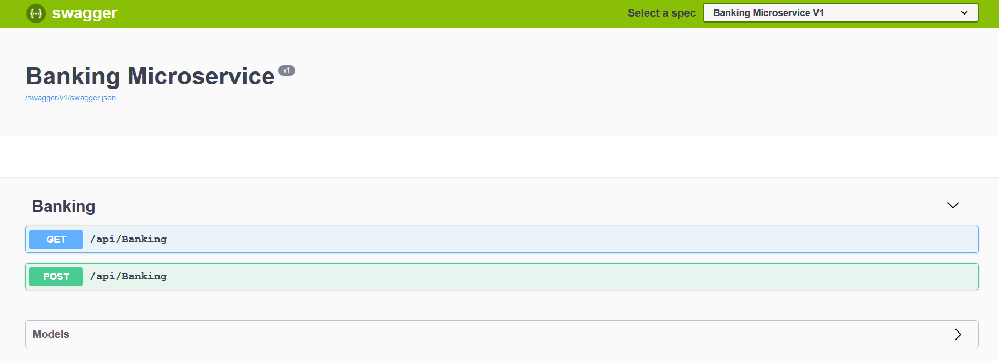
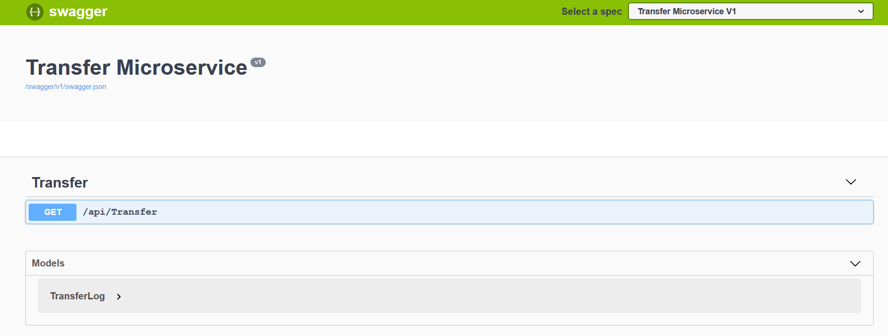
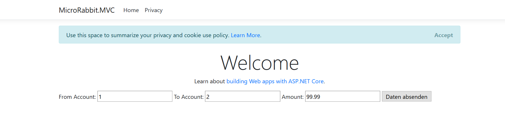

.NET Core Microservice architecture with Aspire Dashboard  all Implemented required design pattern with RabbitMQ messaging and sql Server  

.png)

## Projects
### Dot Net Aspire Projects
- MicroRabbit.AppHost
- MicroRabbit.ServiceDefault
### Web Mvc Projects
- MicroRabbit.MVCNew
### Db Migration Service Project
- MicroRabbit.MigrationService
### Dot Net API Projects
- MicroRabbit.Banking.ApiNew
- MicroRabbit.Transfer.ApiNew
### Dependent Class Libraries
- MicroRabbit.Banking.Application
- MicroRabbit.Banking.Data
- MicroRabbit.Banking.Domain
  
- MicroRabbit.Domain.Core
- MicroRabbit.Infra.Bus
- MicroRabbit.Infra.IoC

- MicroRabbit.Transfer.Application
- MicroRabbit.Transfer.Data
- MicroRabbit.Transfer.Domain

## Notable features

- .Net Aspire Dashboard
- 
- Service Discovery
- Orchestration
- Microservice architecture design pattern
- MediatR Pattern
- Retry Pattern
- RabbitMQ messaging
- DB Migration Services

### Requirements

- [Visual Studio 17.10.1 or Later](https://visualstudio.microsoft.com/de/vs/) or [Visual Studio Code](https://code.visualstudio.com/)
- [.NET 8](https://dotnet.microsoft.com/download)

- Podman Desktop or Docker Desktop
## Project notes

-  In order to run this project, You need to make sure podman or docker desktop is running on your machine.
-  - run following commands
  ` .net workload install aspire `   `and ` .net workload update `

-  Run MicroRabbit.AppHost project, it will open a dashboad where all the endpoin for following services
- **MicroRabbit.Banking.ApiNew** project is listening on localhost (https) and  (http)

- **MicroRabbit.Transfer.ApiNew** project is listening on localhost port  (https) and  (http)

- **MicroRabbit.MVCNew** project is listeing on localhost  (https) and  (http)

### Installation

Check if .NET 8 + and PODMAN/DOCKER is installed on your machine. 

---

### Packages:

- Aspire.Hosting.AppHost 
- Aspire.Hosting.RabbitMQ
- Aspire.Hosting.SqlServer
- Aspire.Microsoft.EntityFrameworkCore.SqlServer
- Microsoft.Extensions.Hosting
- Aspire.Microsoft.Data.SqlClient
- Microsoft.Extensions.DependencyInjection
- MediatR
- Aspire.RabbitMQ.Client
- Swashbuckle.AspNetCore
- Microsoft.Extensions.Http.Resilience" Version=
- Microsoft.Extensions.ServiceDiscovery" Version
- OpenTelemetry.Exporter.OpenTelemetryProtocol" 
- OpenTelemetry.Extensions.Hosting
- OpenTelemetry.Instrumentation.AspNetCore
- OpenTelemetry.Instrumentation.Http
- OpenTelemetry.Instrumentation.Runtime

